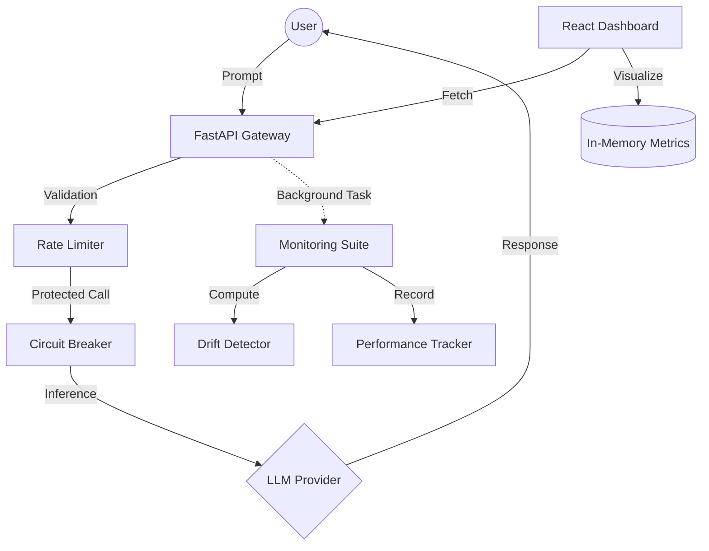

# 🚀 Production-Grade MLOps Pipeline for LLM Deployment

This repository contains a state-of-the-art MLOps pipeline designed for deploying, monitoring, and maintaining Large Language Model (LLM) applications in production environments. It bridges the gap between raw inference and enterprise-grade reliability.

## 🌟 Key Features

### 🧠 Robust Inference Service
- **Multi-Provider Support**: Seamlessly switch between Google Gemini and Mock providers.
- **Circuit Breaker Pattern**: Integrated failure protection at the infrastructure level to prevent cascading outages.
- **Rate Limiting**: Intelligent request throttling to ensure system stability and cost control.

### 📊 Real-Time Observability
- **Dynamic Dashboard**: A premium React-based monitoring interface with real-time charts.
- **Performance Tracking**: Live rolling metrics for Latency (ms), Throughput (RPM), and Error Rates.
- **Statistical Drift Detection**: Automated Kolmogorov-Smirnov tests to detect input distribution shifts (prompt length drift).

### 🛡️ Reliability & Security
- **Asynchronous Monitoring**: Monitoring logic offloaded to background tasks to maintain 0ms overhead on user requests.
- **Structured Logging**: Production-grade JSON logging with Loguru, optimized for ELK/Splunk integration.
- **Resource Monitoring**: Real-time tracking of CPU and Memory utilization.

## 🏗️ System Architecture



## 🛠️ Tech Stack

- **Backend**: Python 3.11+, FastAPI, Pydantic, Scipy, Loguru.
- **Frontend**: React 19, Vite, Tailwind CSS, Recharts, Lucide Icons.
- **DevOps**: Docker, Docker Compose, GitHub Actions (CI/CD).
- **Testing**: Pytest, Httpx (Async Testing).

## 🚀 Quick Start

### 1. Prerequisites
- Python 3.11 or later
- Node.js & npm (for dashboard)
- (Optional) Docker & Docker Compose

### 2. Standard Installation
```bash
# Clone the repository
git clone https://github.com/Sappymukherjee214/MLOps-Pipeline-for-LLM-Deployment-IBM-Level-.git
cd MLOps-Pipeline-for-LLM-Deployment-IBM-Level-

# Setup Backend
pip install -r requirements.txt
python app/main.py

# Setup Dashboard (New Terminal)
cd dashboard
npm install
npm run dev
```

### 3. Running via Docker
```bash
docker-compose up --build
```

## 📊 Testing & Simulation

To experience the full monitoring capabilities, use our specialized simulation tools:

| Tool | Command | Description |
| :--- | :--- | :--- |
| **Integrations** | `pytest tests/test_api.py` | Validates API contract and health. |
| **Traffic Sim** | `python scripts/simulate_traffic.py` | Populates the dashboard with realistic traffic. |
| **Load Test** | `python tests/stress_test.py` | Evaluates system throughput under high concurrency. |

## 📂 Project Structure

- `app/`: Primary FastAPI application logic and routes.
- `monitoring/`: Core statistical and performance tracking modules.
- `models/`: Abstractions for LLM providers (Gemini/Mock).
- `dashboard/`: Modern React-based observability UI.
- `utils/`: Reliability patterns like Circuit Breakers and Logger configs.
- `scripts/`: Operational tools for traffic simulation.

## 📄 License
Distributed under the MIT License. See `LICENSE` for more information.

---
*Built with ❤️ for Robust AI Operations.*
